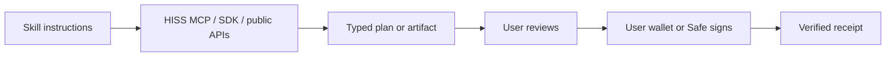
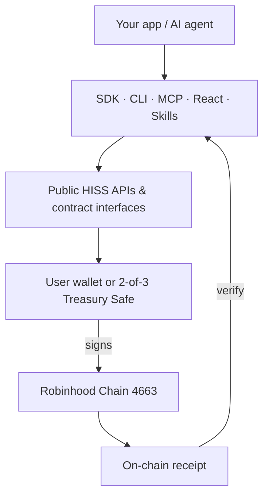

<div align="center">

# 🐍 HISS Finance

### Build vaults, apps, and agents on HISS Finance.

**The open SDK, contract interfaces, agent skills, and MCP tooling for creator-run
USDG vaults on Robinhood Chain — prepare and verify, keep signing control.**

[Website](https://www.hiss.finance) ·
[Docs](./docs/getting-started.md) ·
[Skills](#-install-hiss-agent-skills) ·
[MCP](./docs/mcp.md) ·
[Contracts](./docs/contracts.md) ·
[Security](./SECURITY.md) ·
[X](https://x.com/HissFinance)

**$HISS** `0x47162135cc8fb253f939Bd70e3D2B83075eaeBa3` · [**Robinhood Chain**](./docs/robinhood-chain.md) `4663`

</div>

---

## What is HISS?

HISS is a toolkit for building **transparent, creator-run investment vaults** and
**agent-native financial tooling** on [Robinhood Chain](./docs/robinhood-chain.md).

A HISS vault is an on-chain [ERC-4626](https://eips.ethereum.org/EIPS/eip-4626)
basket denominated in **USDG** (a 6-decimal stablecoin). A creator declares a
target-weight strategy over tokenized equities, ETFs, and cash — as a signed,
hashed [**vault manifest**](./docs/vaults/vault-manifest.md) — and publishes it to
an on-chain registry. Depositors share the vault's profits and losses pro-rata by
share. Every strategy change, rebalance, and fee event is disclosed and, where it
touches the chain, produces a verifiable [receipt](./docs/receipts.md).

HISS is **compilation and verification software**. It prepares, simulates, scores,
and records — it does not take custody of assets, does not hold your keys, and
does not place brokerage orders. **You keep signing control of everything you do.**
Protocol-level actions are governed by a 2-of-3 [Treasury Safe](./docs/trust-boundaries.md).

> **This repository is the open SDK, contract interfaces, and documentation — not
> the production application source.** The hosted product lives at
> [hiss.finance](https://www.hiss.finance). This repo lets you build against the
> same primitives, read the same on-chain state, and integrate agents.

## What can you build?

- **Create and publish vaults** — compose a target-weight basket, validate its
  risk fuses, and publish the manifest to the on-chain registry. See
  [Create a vault](./docs/vaults/create-a-vault.md).
- **Prepare deposits and withdrawals** — build the transactions a depositor signs
  from their own wallet, with full fee and slippage disclosure. See
  [Deposit](./docs/vaults/deposit.md) / [Withdraw](./docs/vaults/withdraw.md).
- **Stake $HISS** — enter the [xHISS](./docs/staking/xhiss.md) single-asset staking
  vault, manage cooldown and redeem windows.
- **Read live protocol state** — deployments, fees, vault readiness, staking and
  reward status, straight from chain reads.
- **Ship agent tooling** — an [MCP server](./docs/mcp.md) exposing 22 read/prepare
  tools, plus [agent skills](#-install-hiss-agent-skills), [x402](./docs/x402.md)
  paid endpoints, and [Bankr](./docs/bankrbot.md) command rails, so agents can
  prepare (never execute) financial actions.
- **Score and audit** — run the [CoilOps](./docs/coilops.md) compile-and-verify
  workbench over rebalance policies and produce post-run audits.

## Choose your builder path

| I want to…                      | Start here                                                             | Docs                                                              |
| ------------------------------- | ---------------------------------------------------------------------- | ----------------------------------------------------------------- |
| **Build & publish a vault**     | [Create a vault manifest](#example-create-a-vault-manifest)            | [Create a vault](./docs/vaults/create-a-vault.md)                 |
| **Integrate HISS into an app**  | [Prepare a deposit](#example-prepare-a-deposit) with the SDK + React   | [SDK](./docs/sdk.md) · [React](./docs/react.md)                   |
| **Equip an AI agent**           | [Install HISS Agent Skills](#-install-hiss-agent-skills)               | [Agent skills](./docs/agent-skills.md)                            |
| **Run the MCP server**          | [Agent / MCP integration](#example-agent--mcp-integration)             | [MCP](./docs/mcp.md)                                              |
| **Use the CLI**                 | [Quickstart](#5-minute-quickstart) → `hiss status`                     | [CLI](./docs/cli.md)                                              |
| **Verify contracts & receipts** | [Contracts & addresses](#current-public-contract-addresses-chain-4663) | [Contracts](./docs/contracts.md) · [Receipts](./docs/receipts.md) |

## 5-minute quickstart

> The packages are **not yet published to npm** — build them from source with
> `pnpm`. **Node.js 20+** and **pnpm 10+** are required (the repo pins
> `pnpm@10.28.1`). The TypeScript packages run directly from source via
> [`tsx`](https://tsx.is); the Solidity contracts use [Foundry](https://book.getfoundry.sh/).
> No private credentials are required — reads use a public RPC you supply.

```bash
# 1. Clone
git clone https://github.com/HissFinance/hiss.git
cd hiss

# 2. Install workspace dependencies
pnpm install --frozen-lockfile

# 3. Build every package
pnpm build

# 4. (optional) Run the test suites
pnpm test
```

Once installed, import the workspace packages into your own app, or run the CLI:

```bash
# Read live protocol status from Robinhood Chain (supply a public RPC)
pnpm --filter @hiss-finance/cli start status \
  --rpc-url https://rpc.mainnet.chain.robinhood.com
```

When the packages are published, this section will switch to a single
`pnpm add @hiss-finance/sdk`. Until then, consume them via the workspace or a
local `file:` / `link:` reference.

## 🧠 Install HISS Agent Skills

HISS ships **10 agent skills** — self-contained `SKILL.md` instruction packs that
teach a compatible coding agent how to work with HISS vaults, staking, rewards,
receipts, Bankr rails, Stock Tokens, the MCP server, and the HISS security
boundaries. They are installed with the open-source [`skills`](https://github.com/vercel-labs/skills)
CLI (`npx skills`), which supports Claude Code, Codex, Cursor, and other clients.

> Skills are **instructions for an agent** — review a `SKILL.md` before installing
> it. HISS skills only **prepare and verify**: they never ask for a private key,
> never sign for you, and never claim a transaction happened without an on-chain
> receipt. See the [safety note](#safety-boundary) below.

### List available skills

```bash
npx skills add HissFinance/hiss --list
```

### Install one skill

```bash
npx skills add HissFinance/hiss --skill hiss-vault-agent-kit
```

### Install every HISS skill

```bash
# --all == --skill '*' --agent '*' -y (all skills, every detected agent)
npx skills add HissFinance/hiss --all
```

### Install for a specific client

```bash
# Claude Code
npx skills add HissFinance/hiss --skill hiss-vault-agent-kit -a claude-code

# Codex
npx skills add HissFinance/hiss --skill hiss-vault-agent-kit -a codex

# every HISS skill, Claude Code only
npx skills add HissFinance/hiss --skill '*' -a claude-code
```

Add `-g` to install at the **user level** (global) instead of project-local, and
`-y` to skip prompts (for CI). Installs are **project-local by default** when run
inside a project.

<details>
<summary><b>Manual / project-local installation</b> (no installer)</summary>

Every skill is a plain directory under [`skills/`](./skills). To install one by
hand, copy it into your agent's skills directory:

```bash
# Claude Code (project-local)
mkdir -p .claude/skills
cp -R skills/hiss-vault-agent-kit .claude/skills/

# Codex (project-local)
mkdir -p .agents/skills
cp -R skills/hiss-vault-agent-kit .agents/skills/
```

For an agent with no native skill support, open the raw `SKILL.md` and paste it in
as project instructions/context:
`https://github.com/HissFinance/hiss/blob/main/skills/hiss-vault-agent-kit/SKILL.md`

</details>

### Use a skill without installing, update, or remove

```bash
# Print a one-shot prompt for a single skill without installing it
npx skills use HissFinance/hiss@hiss-vault-agent-kit

# Update installed skills to the latest version
npx skills update

# Remove a skill
npx skills remove hiss-vault-agent-kit
```

### Skill catalog

Each skill preserves the **prepare-never-execute** boundary: the agent reads,
scores, and prepares; **your wallet or Safe signs**; only an on-chain receipt
proves completion.

| Skill                                                                      | Use it when you want an agent to…                                                                                                                 | It produces                                                                               |
| -------------------------------------------------------------------------- | ------------------------------------------------------------------------------------------------------------------------------------------------- | ----------------------------------------------------------------------------------------- |
| [**hiss-vault-agent-kit**](./skills/hiss-vault-agent-kit/SKILL.md)         | Discover vaults, read manifests/fees, create a vault **candidate**, prepare deposits/withdrawals, preview rebalances under fuses, verify receipts | Manifests + `manifestHash`, deposit/withdraw intents + ack hashes, readiness/risk reports |
| [**hiss-coilops**](./skills/hiss-coilops/SKILL.md)                         | Turn a market thesis into a bounded, versioned trading **Coil** — generate, validate, score, compile                                              | CoilManifest, Coil Health score, runbook, share card, receipts                            |
| [**hiss-staking**](./skills/hiss-staking/SKILL.md)                         | Guide xHISS staking — read state, prepare stake, start the 72h cooldown, redeem in the window                                                     | Prepared stake/cooldown/redeem intents; status & injection reads                          |
| [**hiss-rewards**](./skills/hiss-rewards/SKILL.md)                         | Explain & verify the 50/15/15/10/10 split (incl. economic burn); distinguish planned ≠ funded ≠ claimable                                         | Deterministic split plans with a `planHash`; state explanations                           |
| [**hiss-receipts**](./skills/hiss-receipts/SKILL.md)                       | Write and verify canonical-JSON SHA-256 receipts; reject any forged execution claim                                                               | Receipts and `{ok, mismatches[]}` verification verdicts                                   |
| [**hiss-risk-fuses**](./skills/hiss-risk-fuses/SKILL.md)                   | Audit the binding risk fuses on a Coil and explain why a capsule will/won't compile                                                               | Per-fuse descriptions, bound-check issues, a `risk_fuse` receipt                          |
| [**hiss-stock-tokens**](./skills/hiss-stock-tokens/SKILL.md)               | Prepare, validate, and reconcile Bankr trades of the 15 canonical Robinhood Chain stock tokens                                                    | Order plan + exact Bankr command; a settlement receipt from an on-chain tx                |
| [**hiss-bankrbot-robinhood**](./skills/hiss-bankrbot-robinhood/SKILL.md)   | Compile a Coil for the Bankrbot → Robinhood MCP path — paper-first, live-readiness gated                                                          | Bankrbot command pack, Robinhood MCP capsule, paper runbook, audit                        |
| [**hiss-mcp**](./skills/hiss-mcp/SKILL.md)                                 | Drive the HISS tools over the local MCP server rather than raw HTTP                                                                               | Prepared artifacts and verified state reads via MCP tools                                 |
| [**hiss-security-boundaries**](./skills/hiss-security-boundaries/SKILL.md) | Enforce the trust boundaries — no custody, no credentials, no execution claims, autonomy consent gates                                            | The guardrail reference the other skills are checked against                              |

### How skills work



### Safety boundary

Agents **prepare and verify**. They do **not** receive private keys, sign for you,
or prove execution without an on-chain receipt. Never paste seed phrases, private
keys, session cookies, or API secrets into an agent — HISS skills never need them,
and every HISS tool rejects credential-shaped input. Agent output is **not** proof
of execution: only a verified receipt proves a transaction happened.

## Repository packages

| Package                                             | What it does                                                                                                                                                         |
| --------------------------------------------------- | -------------------------------------------------------------------------------------------------------------------------------------------------------------------- |
| [`@hiss-finance/core`](./docs/sdk.md)               | The shared truth layer: typed constants, fee and reward math, manifest schemas, chain config, address book, and pure resolvers. No I/O — deterministic and testable. |
| [`@hiss-finance/sdk`](./docs/sdk.md)                | High-level client: read vault/staking/reward state and **prepare** (build, never sign) deposit, withdraw, stake, and manifest-publish transactions.                  |
| [`@hiss-finance/vault-kit`](./docs/vaults/index.md) | Vault authoring helpers: compose allocations, validate risk fuses, compute fee previews, and hash a manifest.                                                        |
| [`@hiss-finance/react`](./docs/react.md)            | React hooks and headless components for vault, staking, and reward surfaces. Bring your own wallet connector.                                                        |
| [`@hiss-finance/cli`](./docs/cli.md)                | A terminal client for status reads, manifest validation, and transaction preparation.                                                                                |
| [`@hiss-finance/mcp-server`](./docs/mcp.md)         | A local Model Context Protocol server exposing 22 read/prepare tools to any MCP-compatible agent. Read and prepare only — never executes.                            |

Smart-contract interfaces and ABIs live under [`contracts/`](./docs/contracts.md);
JSON schemas under `schemas/`; runnable examples under
[`examples/`](./docs/getting-started.md#examples); agent skill packs under
[`skills/`](./docs/agent-skills.md).

## Architecture

Everything in this repo sits on the **prepare** side of the signing boundary. It
reads public state and builds unsigned artifacts; **you** (or a Safe) sign, and
the chain is the source of truth.



## Live product links

- **Product:** [www.hiss.finance](https://www.hiss.finance)
- **Robinhood Chain docs:** [docs.robinhood.com/chain/connecting](https://docs.robinhood.com/chain/connecting)
- **Block explorer (mainnet):** [robinhoodchain.blockscout.com](https://robinhoodchain.blockscout.com)

## Robinhood Chain configuration

| Field            | Mainnet                                   | Testnet                                        |
| ---------------- | ----------------------------------------- | ---------------------------------------------- |
| Chain ID         | `4663`                                    | `46630`                                        |
| Network name     | Robinhood Chain                           | Robinhood Chain Testnet                        |
| RPC URL          | `https://rpc.mainnet.chain.robinhood.com` | `https://rpc.testnet.chain.robinhood.com`      |
| Native currency  | ETH (18 decimals)                         | ETH (18 decimals)                              |
| Block explorer   | `https://robinhoodchain.blockscout.com`   | `https://explorer.testnet.chain.robinhood.com` |
| Base vault asset | USDG (6 decimals)                         | —                                              |

Full details in [Robinhood Chain](./docs/robinhood-chain.md). Always verify chain
config against the [official Robinhood docs](https://docs.robinhood.com/chain/connecting).

## Current public contract addresses (chain 4663)

Addresses are load-bearing — never abbreviate them. On-chain state is always the
source of truth; see [`docs/generated/current-deployments.md`](./docs/generated/current-deployments.md)
for the stamped snapshot.

| Contract / account          | Address                                      |
| --------------------------- | -------------------------------------------- |
| USDG (base asset, 6dp)      | `0x5fc5360D0400a0Fd4f2af552ADD042D716F1d168` |
| $HISS token (18dp)          | `0x47162135cc8fb253f939Bd70e3D2B83075eaeBa3` |
| VaultFactory                | `0x278d237c6890a5f7101296a9021ed9D26c821810` |
| HISS Vault (flagship)       | `0x6d962604df1c6c5ef4b59d88863600fe71bb63e6` |
| xHISS staking vault         | `0x699861D2C546ab86a7f2AE97ffc7aF89f3FF67Be` |
| HISS Treasury Safe (2-of-3) | `0xF100Fc28dd1721C698046Dbd60408c523b69e36c` |

The full address book (registries, distributors, adapters) is in
[`docs/contracts.md`](./docs/contracts.md).

## Example: create a vault manifest

The SDK **prepares** artifacts and transactions. Nothing is signed for you.

```ts
import { composeVaultManifest, validateVaultFeeConfig, defaultVaultFeeConfig } from "@hiss-finance/vault-kit";

const feeConfig = defaultVaultFeeConfig("0xYourCreatorFeeRecipient");
// -> 10% performance fee, 10% HISS protocol share, routing fee 0 (routing disabled)

const issues = validateVaultFeeConfig(feeConfig);
if (issues.length) throw new Error(JSON.stringify(issues));

const { manifest, manifestHash } = composeVaultManifest({
  name: "Mega-cap Tech Basket",
  baseAsset: "USDG",
  chainId: 4663,
  targetWeightsBps: { AAPL: 1500, MSFT: 1500, NVDA: 1500, SPY: 3500, USDG: 2000 },
  feeConfig,
  strategyNoticePeriodSeconds: 604_800, // 7-day change notice
});

// Saving a candidate is free. Publishing a public vault costs a one-time
// creation fee and requires >= 5% creator skin before public deposits open.
```

See [Create a vault](./docs/vaults/create-a-vault.md) and
[Vault manifest](./docs/vaults/vault-manifest.md).

## Example: prepare a deposit

```ts
import { HissClient } from "@hiss-finance/sdk";

const hiss = new HissClient({ chainId: 4663, rpcUrl: "https://rpc.mainnet.chain.robinhood.com" });

// A read: current share price and readiness (always a live chain read).
const vault = await hiss.vaults.read("0x6d962604df1c6c5ef4b59d88863600fe71bb63e6");

// A prepare: returns the approve + deposit transactions for the USER to sign.
const txs = await hiss.vaults.prepareDeposit({
  vault: vault.address,
  depositor: "0xDepositor",
  amountUsdg: 1_000_000_000n, // 1,000 USDG (6 decimals)
});

// You sign and send `txs` with your own wallet. The deposit is complete only
// on the on-chain receipt — never before.
```

See [Deposit](./docs/vaults/deposit.md).

## Example: stake $HISS

```ts
import { HissClient } from "@hiss-finance/sdk";

const hiss = new HissClient({ chainId: 4663 });

// Prepare a stake into the xHISS vault (single-asset staking over $HISS).
const stakeTxs = await hiss.staking.prepareStake({ staker: "0xStaker", amountHiss: 500n * 10n ** 18n });

// Exiting is a two-step, non-pausable flow: start a 72h cooldown, then redeem
// within the 2-day window.
const cooldownTx = await hiss.staking.prepareStartCooldown({
  staker: "0xStaker",
  xShares: 250n * 10n ** 18n,
});
```

See [xHISS staking](./docs/staking/xhiss.md) and
[Cooldown and redeem](./docs/staking/cooldown-and-redeem.md).

> Staking is a mechanical position, not a yield promise. **Not a performance
> claim. Historical fee distributions are not forecasts.**

## Example: agent / MCP integration

Run the local MCP server and connect any MCP-compatible agent. Every tool is
read, prepare, or score — **agents never execute trades or move funds**.

```bash
pnpm --filter @hiss-finance/mcp-server start
```

```jsonc
// Example MCP client config (stdio transport)
{
  "mcpServers": {
    "hiss": { "command": "pnpm", "args": ["--filter", "@hiss-finance/mcp-server", "start"] },
  },
}
```

The server registers **22 tools** (12 read, 10 prepare). Representative tools:
`hiss_get_protocol_status`, `hiss_get_fee_schedule`, `hiss_get_staking_status`,
`hiss_create_vault_candidate`, `hiss_prepare_vault_deposit`,
`hiss_prepare_hiss_stake`, `hiss_verify_receipt`. Full list in
[MCP tools](./docs/mcp.md). Agents can also call [x402 paid endpoints](./docs/x402.md)
and prepare [Bankr commands](./docs/bankrbot.md).

## How fees work

The HISS **website and first-party app tools are free** — no subscriptions, no
credits, no paywalls — and the packages here are open-source (Apache-2.0). You
keep signing control; HISS only prepares and verifies. What you may still pay are
**normal network gas** and **contract-enforced protocol fees** (shown below) — these
are on-chain costs, not HISS charges. [x402](./docs/x402.md) services are separate,
opt-in machine-to-machine (agent) rails where configured.

Every fee is disclosed; there are no hidden spreads. Current launch values:

| Fee                      | Value                        | Notes                                                                                                               |
| ------------------------ | ---------------------------- | ------------------------------------------------------------------------------------------------------------------- |
| Vault candidate save     | **0 USDG**                   | Always free.                                                                                                        |
| Public vault creation    | **50 USDG** (launch)         | Paid once, by the creator, when publishing on-chain. Candidate figure; the deployed factory is the source of truth. |
| Creator performance fee  | **10%** default              | Of new profit **above the high-water mark** only. No fee on losses. Cap 10% (unverified) / 20% (verified).          |
| HISS protocol share      | **10%** of the creator fee   | A share of the creator's performance fee — never an extra charge on depositor principal.                            |
| Deposit / withdrawal fee | **0 / 0**                    | Chain gas, liquidity unwind, and slippage are disclosed separately.                                                 |
| Routing fee              | **0** while routing disabled | 0.5–2 bps of rebalance notional only once HISS live routing is enabled.                                             |

The full, worked-through fee guide — including $HISS token trading fees — is in
[`docs/fees/`](./docs/fees/index.md).

## The HISS flywheel

Verified **$HISS token trading fees** (from the Bankr/Doppler launch pool) are, on
the HISS side, split **50 / 15 / 15 / 10 / 10** (**HISS Reward Method V2**):

- **50%** → [xHISS](./docs/staking/xhiss.md) stakers (an ERC-4626 reward injection)
- **15%** → eligible [vault providers](./docs/rewards/provider-rewards.md) (facts-only scoring, 90-day vesting)
- **15%** → eligible [vault contributors](./docs/rewards/depositor-rewards.md) (by share-seconds, 30-day vesting)
- **10%** → the Treasury Safe (absorbs rounding dust; legs sum exactly)
- **10%** → **economic burn** to the canonical dead address `0x000000000000000000000000000000000000dEaD`

**Vault contributors** is the current name for the former **depositor** reward
cohort (methodology unchanged); **V1** (50/30/10/10, no burn) is historical. The
burn leg is an **economic burn** — $HISS is transferred to the dead address and
leaves circulation, but the transfer does **not reduce `HISS.totalSupply`** (the
burn metric is the dead-address balance). The retroactive V2 migration executed a
cumulative economic burn of **~219.16M HISS** to the dead address, with
`totalSupply` unchanged.

Claimed **WETH** fees are **100%** to the Treasury Safe — never split. State is
always chained: **planned ≠ funded ≠ vesting ≠ claimable**. Read the full
mechanism in [Reward flywheel](./docs/fees/reward-flywheel.md).

## Security and the signing boundary

- **User wallet signs user actions.** Deposits, withdrawals, staking, and manifest
  publishes are transactions **you** sign from **your** wallet. HISS never holds
  your keys.
- **Treasury Safe (2-of-3) signs protocol actions.** Ownership changes, reward
  funding, and injector authorization require the multisig.
- **The SDK/CLI prepare only.** They build transactions and artifacts; they do not
  broadcast on your behalf.
- **No custody, no brokerage execution.** HISS never holds pooled assets outside
  the audited contracts and never places brokerage orders.

See [Security](./docs/security.md), [Trust boundaries](./docs/trust-boundaries.md),
and [SECURITY.md](./SECURITY.md).

## Current protocol lifecycle

Live, stamped snapshots (deployments, fees, status) are regenerated from chain
reads and committed under [`docs/generated/`](./docs/generated/current-status.md).
Because on-chain state changes, treat those files as **snapshots with a freshness
limit** — re-read the chain for anything transactional.

## Regional and Stock Token disclosures

- **Tokenized Stock Tokens and ETF tokens are economic exposure only.** They confer
  **no legal or beneficial ownership** in the underlying issuer, no voting rights,
  and no direct dividend entitlement.
- **Availability is region- and provider-dependent.** Some surfaces (including
  Bankr rails and Robinhood's own agentic trading) have limited, jurisdiction-gated
  rollout. See [Stock Tokens](./docs/stock-tokens.md).
- **HISS is not a fund, broker, or investment adviser**, is **not affiliated with
  Robinhood**, and nothing here is investment advice. **No guaranteed yield, no
  APY promise, no passive income.** Vaults share profits _and_ losses.

## Examples

Runnable, self-contained examples live in [`examples/`](./docs/getting-started.md#examples):
reading status, composing and validating a manifest, previewing fees, preparing a
deposit, and driving the MCP server.

## Documentation map

| Area              | Start here                                                                                                                                                                                                         |
| ----------------- | ------------------------------------------------------------------------------------------------------------------------------------------------------------------------------------------------------------------ |
| Orientation       | [Getting started](./docs/getting-started.md) · [Architecture](./docs/architecture.md) · [Glossary](./docs/glossary.md) · [FAQ](./docs/faq.md)                                                                      |
| Chain & contracts | [Robinhood Chain](./docs/robinhood-chain.md) · [Contracts](./docs/contracts.md)                                                                                                                                    |
| Packages          | [SDK](./docs/sdk.md) · [CLI](./docs/cli.md) · [React](./docs/react.md) · [MCP](./docs/mcp.md)                                                                                                                      |
| Vaults            | [Overview](./docs/vaults/index.md) · [Create](./docs/vaults/create-a-vault.md) · [Manifest](./docs/vaults/vault-manifest.md) · [Risk fuses](./docs/vaults/risk-fuses.md)                                           |
| Fees              | [Overview](./docs/fees/index.md) · [Vault fees](./docs/fees/vault-fees.md) · [$HISS token fees](./docs/fees/hiss-token-fees.md) · [Reward flywheel](./docs/fees/reward-flywheel.md)                                |
| Staking           | [Overview](./docs/staking/index.md) · [xHISS](./docs/staking/xhiss.md) · [Cooldown & redeem](./docs/staking/cooldown-and-redeem.md)                                                                                |
| Rewards           | [Overview](./docs/rewards/index.md) · [Vault contributors](./docs/rewards/depositor-rewards.md) · [Vault providers](./docs/rewards/provider-rewards.md) · [Epochs & vesting](./docs/rewards/epochs-and-vesting.md) |
| Agents            | [Agent skills](./docs/agent-skills.md) · [Bankrbot](./docs/bankrbot.md) · [x402](./docs/x402.md) · [CoilOps](./docs/coilops.md)                                                                                    |
| Safety            | [Security](./docs/security.md) · [Trust boundaries](./docs/trust-boundaries.md) · [Receipts](./docs/receipts.md) · [Data freshness](./docs/status-and-data-freshness.md)                                           |

## Contributing

Contributions are welcome. Please read [CONTRIBUTING.md](./CONTRIBUTING.md) and the
[Code of Conduct](./CODE_OF_CONDUCT.md) first. Maintainers are listed in
[MAINTAINERS.md](./MAINTAINERS.md); the release history is in
[CHANGELOG.md](./CHANGELOG.md) and the plan ahead in [ROADMAP.md](./ROADMAP.md).

## Security reporting

Please **do not** open public issues for security vulnerabilities. Use GitHub's
[private vulnerability reporting](https://docs.github.com/code-security/security-advisories/guidance-on-reporting-and-writing-information-about-vulnerabilities/privately-reporting-a-security-vulnerability)
on this repository, or the process described in [SECURITY.md](./SECURITY.md).

## License

Licensed under the [Apache License 2.0](./LICENSE). See [NOTICE](./NOTICE) and
[THIRD_PARTY_LICENSES.md](./THIRD_PARTY_LICENSES.md).

## Disclaimer

HISS Finance is compilation and verification software provided "as is", without
warranty of any kind. It is not a fund, broker, exchange, or investment adviser,
and it is **not affiliated with Robinhood, Bankr, Doppler, or Chainlink**. Nothing
in this repository is investment, legal, or tax advice. Digital assets and
tokenized instruments carry risk, including total loss. Vaults share profits and
losses; there is **no guaranteed yield and no APY promise**. Tokenized Stock Tokens
are economic exposure only and are restricted in some jurisdictions. You are solely
responsible for your own transactions and for complying with the laws that apply to
you.
